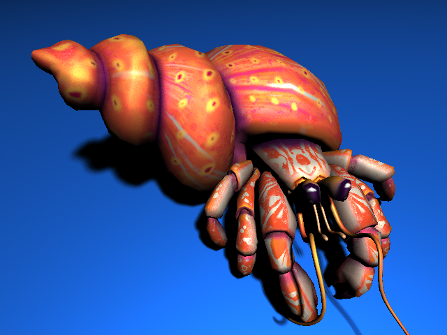

# RAYTRACER

A basic C++ raytracer accelerated with OpenCL.
<p align="center">

<p/>

## Dependencies

- [VCPKG](https://vcpkg.io/)
- [CMake](https://cmake.org/)

## Build

```
cmake -DCMAKE_TOOLCHAIN_FILE=${PATH_TO_VCPKG}/scripts/buildsystems/vcpkg.cmake -B build -S .
```

## Getting started
- Move the camera point of view with middle mouse button.
- Press **Ctrl + R** to start rendering an image. The 3D view will then stop process any keyboard our mouse events until the render job is finished.
- Once the render job is finished, go check the assets/render folder, it contains the rendered image named "img.bmp".

## Raytraced crab : CPU vs GPU performances
<p>
640x480 Image resolution.<br/>
Scene with 5438 triangles.<br/>
The machine used got an Intel i5-9300H CPU and an Nvidia GTX 1660 Ti GPU.<br/>
<br/>
<p/>

|    Hardware   |Render time|
|:-------------:|----------:|
|CPU (8 threads)|163,068 sec|
|GPU            |  1,477 sec|

The GPU renders that image 110 times faster than the CPU.



