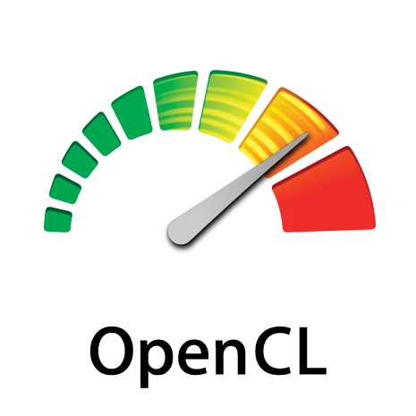
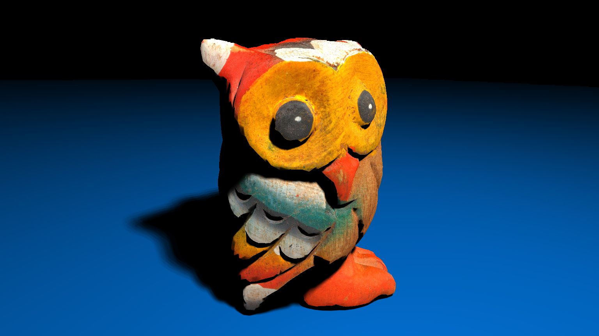

# RAYTRACER

A basic C++ Raytracer accelerated with OpenCL.
<br/>
<p align="center">

<p/>
<br/>

## Dependencies

- [VCPKG](https://vcpkg.io/)
- [CMake](https://cmake.org/)

## Build

```
cmake -DCMAKE_TOOLCHAIN_FILE=${PATH_TO_VCPKG}/scripts/buildsystems/vcpkg.cmake -B build -S .
```

## Raytraced Owl



## Getting started

- Press **Ctrl + R** to start rendering.
